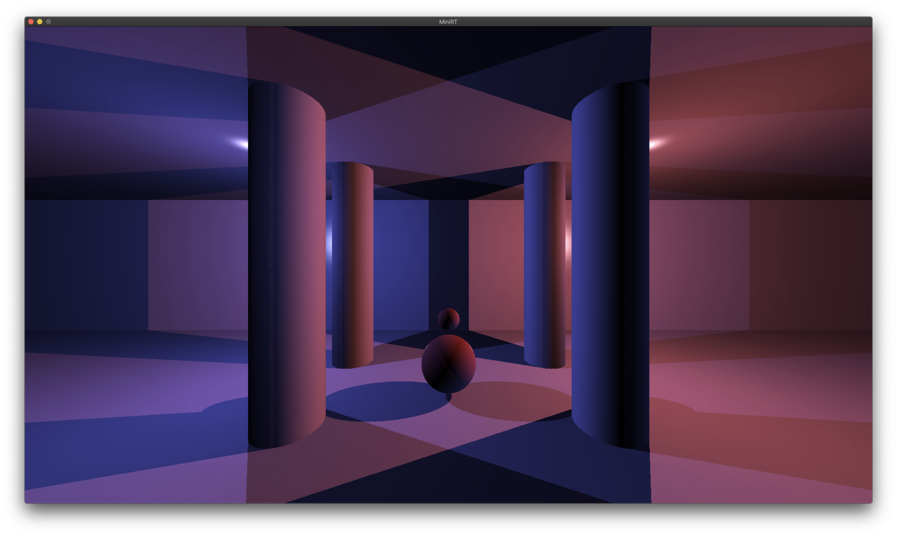

+++
title = "miniRT"
template = "project.html"
weight = 8
description = "-42 School project"
+++

<a target="blank" href="https://github.com/sebamiro/MiniRT">GitHub</a>

---

# MiniRT

## Summary

Is a group project about crating a ray tracer engine in C that handles scene files, multiple
cameras and hard shadows with multiple light.

Supported primitives:
- spheres
- planes
- cylinders



## Introduction

When it comes to rendering 3-dimensional computer-generated images there are 2 possi-
ble approaches: “Rasterization”, which is used by almost all graphic engines because
of its efficiency and “Ray Tracing.”

The “Ray Tracing” method, developed for the first time in 1968 (but improved upon
since) is even today more expensive in computation than the “Rasterization” method.
As a result, it is not yet fully adapted to real time use-cases but it produce a much higher
degree of visual realism.

Before you can even begin to produce such high-quality graphics, you must mas-
ter the basics: the miniRT is your first ray tracer coded in C, normed and humble but
functionnal.

The main goal of miniRT is to prove to yourself that you can implement any mathe-
matics or physics formulas without being a mathematician, we will only implement the
most basics ray tracing features here so just keep calm, take a deep breath and don’t
panic! After this project you’ll be able to show off nice-looking pictures to justify the
number of hours you’re spending at school...

## Mandatory part

The goal of your program is to generate
images using the Raytracing protocol. Those
computer-generated images will each represent a
scene, as seen from a specific angle and position,
defined by simple geometric objects, and each with
its own lighting system.

The constraints are as follows:
- You must use the miniLibX. Either the version that is available on the operating
system, or from its sources. If you choose to work with the sources, you will
need to apply the same rules for your libft as those written above in Common
Instructions part.
- The management of your window must remain smooth: changing to another win-
dow, minimizing, etc.
- You need at least these 3 simple geometric objects: plane, sphere, cylinder.
- If applicable, all possible intersections and the inside of the object must be handled
correctly.
- Your program must be able to resize the object’s unique properties: diameter for a
sphere and the width and height for a cylinder.
- Your program must be able to apply translation and rotation transformation to
objects, lights and cameras (except for spheres and lights that cannot be rotated).
- Light management: spot brightness, hard shadows, ambiance lighting (objects are
never completely in the dark). You must implement Ambient and diffuse lighting.
- the program displays the image in a window and respect the following rules:
  - Pressing ESC must close the window and quit the program cleanly.
  - Clicking on the red cross on the window’s frame must close the window and
quit the program cleanly.
  - The use of images of the minilibX is strongly recommended.
- Your program must take as a first argument a scene description file with the .rt
extension.
  - Each type of element can be separated by one or more line break(s).
  - Each type of information from an element can be separated by one or more
space(s).
  - Each type of element can be set in any order in the file.
  - Elements which are defined by a capital letter can only be declared once in
the scene.
  - Each element first’s information is the type identifier (composed by one or two
character(s)), followed by all specific information for each object in a strict
order such as:
  - Ambient lightning : ``` A 0.2 255,255,255 ```
      - identifier: A
      - ambient lighting ratio in range [0.0,1.0]: 0.2
      - R,G,B colors in range [0-255]: 255, 255, 255
  - Camera : ``` C -50.0,0,20 0,0,1 70 ```
    - identifier: C
    - x,y,z coordinates of the view point: 0.0,0.0,20.6
    - 3d normalized orientation vector. In range [-1,1] for each x,y,z axis:
0.0,0.0,1.0
    - FOV : Horizontal field of view in degrees in range [0,180]
  - Light : ``` L -40.0,50.0,0.0 0.6 10,0,255 ```
    - identifier: L
    - x,y,z coordinates of the light point: 0.0,0.0,20.6
    - the light brightness ratio in range [0.0,1.0]: 0.6
    - R,G,B colors in range [0-255]: 10, 0, 255
  - Sphere : ``` sp 0.0,0.0,20.6 12.6 10,0,255 ```
    - identifier: sp
    - x,y,z coordinates of the sphere center: 0.0,0.0,20.6
    - the sphere diameter: 12.6
    - R,G,B colors in range [0-255]: 10, 0, 255
  - Plane : ``` pl 0.0,0.0,-10.0 0.0,1.0,0.0 0,0,225 ```
    - identifier: pl
    - x,y,z coordinates: 0.0,0.0,-10.0
    - 3d normalized orientation vector. In range [-1,1] for each x,y,z axis:
    0.0,0.0,1.0
    - R,G,B colors in range [0-255]: 0, 0, 255
  - Cylinder : ```cy 50.0,0.0,20.6 0.0,0.0,1.0 14.2 21.42 10,0,255```
    - x,y,z coordinates: 50.0,0.0,20.6
    - 3d normalized orientation vector. In range [-1,1] for each x,y,z axis:
    - identifier: cy
    0.0,0.0,1.0
    - the cylinder diameter: 14.2
    - the cylinder height: 21.42
    - R,G,B colors in range [0,255]: 10, 0, 255
  - Example of the mandatory part with a minimalist .rt scene:
```
A 0.2 255,255,255
C -50,0,20 0,0,0 70
L -40,0,30 0.7 255,255,255
pl 0,0,0 0,1.0,0 255,0,225
sp 0,0,20 20 255,0,0
cy 50.0,0.0,20.6 0,0,1.0 14.2 21.42 10,0,255
```
  - If any misconfiguration of any kind is encountered in the file the program must exit
properly and return "Error\n" followed by an explicit error message of your choice.
  - For the defense, it would be ideal for you to have a whole set of scenes with the
focus on what is functional, to facilitate the control of the elements to create.

## Bonus part

The Ray-Tracing technique could handle many more things like reflection, transparency,
refraction, more complex objects, soft shadows, caustics, global illumination, bump map-
ping, .obj file rendering etc..

But for the miniRT project, we want to keep things simple for your first raytracer and
your first steps in CGI.

So here is a list of few simple bonuses you could implement, if you want to do bigger
bonuses we strongly advise you to recode a new ray-tracer later in your developer life
after this little one is finished and fully functionnal.

Bonus list:
- Add specular reflection to have a full Phong reflection model.
- Color disruption: checkerboard.
- Colored and multi-spot lights.
- One other 2nd degree object: Cone, Hyperboloid, Paraboloid..
- Handle bump map textures.

